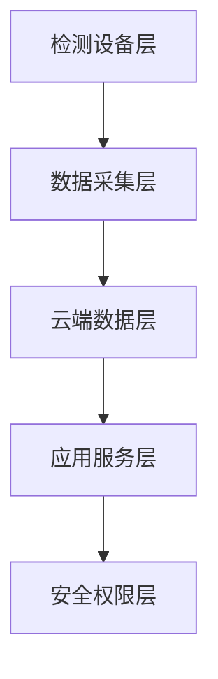

# 非法添加药物紫外光谱云端筛查识别系统

[](https://opensource.org/licenses/MIT)
[](https://github.com/chenxingqiang/uv-detection-platform/issues)
[](https://github.com/chenxingqiang/uv-detection-platform/stargazers)

## 🎯 项目概述

本项目是一个完整的**企业级技术方案文档生成系统**，专注于非法添加药物检测领域的技术方案开发。项目展示了从内容规划到专业PDF生成的完整工作流程。

### 核心特性

- 🔬 **专业技术方案**：250+种非法添加物质检测，LC-DAD液相色谱技术
- 📊 **云端架构设计**：5层云架构，分布式数据处理，AI模型集成
- 📄 **专业PDF生成**：LaTeX排版，品牌元素集成，自动化转换
- 🔧 **完整工具链**：Markdown → LaTeX → PDF的完整转换流程

## 📋 项目结构

```
uv-detection-platform/
├── docs/                           # 文档目录
│   └── technical_solution.md       # 技术解决方案
├── src/                            # 源代码目录
│   ├── api/                        # API接口
│   ├── core/                       # 核心模块
│   ├── data/                       # 数据处理
│   ├── infrastructure/             # 基础设施
│   └── models/                     # 数据模型
├── tests/                          # 测试目录
├── scripts/                        # 脚本工具
├── configs/                        # 配置文件
├── plan.md                         # 主要技术方案文档
├── target.md                       # 项目目标文档
├── 项目完成总结_提示词.md           # 项目总结与提示词
└── logo.png                        # 公司Logo
```

## 🚀 快速开始

### 环境要求

- **Python 3.8+**
- **Pandoc 2.19+**
- **XeLaTeX** (TeX Live 2022+)
- **Node.js 16+** (用于Mermaid图表)
- **PyYAML** (用于配置文件解析)

### 安装依赖

```bash
# 安装Pandoc
brew install pandoc

# 安装LaTeX
brew install --cask mactex

# 安装Mermaid CLI
npm install -g @mermaid-js/mermaid-cli

# 安装Pandoc过滤器
pipx install pandoc-mermaid-filter

# 安装Python依赖
pip install PyYAML
```

### 生成PDF文档

```bash
# 基本转换
pandoc plan.md \
  --filter pandoc-mermaid \
  --pdf-engine=xelatex \
  --number-sections \
  --variable=graphics:yes \
  --variable=geometry:margin=2cm \
  -o 技术方案.pdf

# 高质量转换（推荐）
pandoc plan.md \
  --filter pandoc-mermaid \
  --pdf-engine=xelatex \
  --number-sections \
  --variable=graphics:yes \
  --variable=geometry:margin=2cm \
  --variable=CJKmainfont="Source Han Serif SC" \
  --variable=CJKsansfont="Source Han Sans SC" \
  --variable=monofont="Monaco" \
  --listings \
  -o 技术方案_专业版.pdf
```

## 🎯 通用模板使用

### 快速生成配置文件

```bash
# 生成项目配置模板
python template_generator.py --generate-config

# 这将创建 project_config.yaml 文件
```

### 使用配置文件生成文档

```bash
# 1. 编辑配置文件
vim project_config.yaml

# 2. 生成具体的提示词文档
python template_generator.py --config project_config.yaml --output 我的项目提示词.md

# 3. 验证配置完整性
python template_generator.py --validate project_config.yaml
```

### 交互式配置模式

```bash
# 交互式填写变量
python template_generator.py --interactive --output 交互生成的提示词.md
```

### 配置文件示例

```yaml
# 基础信息
原始领域: "区块链金融"
目标领域: "AI驱动的智能合约"
原始文档名: "blockchain_plan"
目标文档名: "ai_contract_target"

# 公司信息
公司全称: "XX科技有限公司"
公司简称: "XX科技"
logo文件名: "company_logo.png"
文档日期: "2025年8月"

# 技术栈
原始技术栈: "传统区块链"
目标技术栈: "AI+区块链融合"
原始核心技术: "智能合约"
目标核心技术: "AI驱动智能合约"
```

## 📖 技术方案亮点

### 🔬 检测技术栈

- **LC-DAD液相色谱**：高精度分离检测
- **多维特征融合**：UV光谱 + 保留时间 + 峰面积
- **三级识别模型**：相似度匹配 + 机器学习 + 深度学习

### ☁️ 云端架构



### 🤖 AI算法

- **传统机器学习**：PLS、SVM、Random Forest
- **深度学习**：1D-CNN、LSTM时序分析
- **模型集成**：多算法融合，提升准确率至95%+

## 📊 性能指标

| 指标 | 目标值 | 说明 |
|------|--------|------|
| 检测准确率 | >95% | 整体识别准确率 |
| 假阳性率 | <3% | 误报率控制 |
| 假阴性率 | <2% | 漏检率控制 |
| 系统并发 | 1000+ | 同时在线用户 |
| 响应时间 | <2s | 检测结果返回 |

## 🛠️ 开发工具链

### 文档生成工具

- **Pandoc**：Markdown到PDF转换核心
- **XeLaTeX**：专业排版引擎
- **Mermaid**：图表生成
- **tcolorbox**：代码块美化

### 字体配置

```latex
\setmainfont{Source Han Serif SC}
\setsansfont{Source Han Sans SC}
\setmonofont{Monaco}
```

## 📝 项目管理

### 开发周期

- **总周期**：36个月
- **阶段划分**：5个主要阶段
- **团队配置**：项目经理 + 技术总监 + 4个专业组

### 质量保证

- **ISO标准**：ISO 11843、ICH Q2(R1)
- **安全合规**：网络安全等级保护2.0
- **测试覆盖**：单元测试、集成测试、性能测试

## 🤝 贡献指南

1. Fork 本仓库
2. 创建特性分支 (`git checkout -b feature/AmazingFeature`)
3. 提交更改 (`git commit -m 'Add some AmazingFeature'`)
4. 推送到分支 (`git push origin feature/AmazingFeature`)
5. 打开 Pull Request

## 📄 许可证

本项目采用 MIT 许可证 - 查看 [LICENSE](LICENSE) 文件了解详情

## 📞 联系方式

- **项目维护者**：陈星强
- **邮箱**：[your-email@example.com]
- **GitHub**：[@chenxingqiang](https://github.com/chenxingqiang)

## 🙏 致谢

感谢以下开源项目的支持：

- [Pandoc](https://pandoc.org/) - 文档转换工具
- [Mermaid](https://mermaid-js.github.io/) - 图表生成
- [LaTeX](https://www.latex-project.org/) - 排版系统
- [Source Han Fonts](https://github.com/adobe-fonts/source-han-serif) - 中文字体

---

⭐ 如果这个项目对你有帮助，请给个星标支持！
