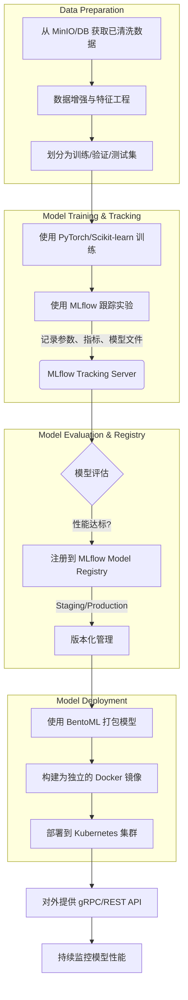

# **紫外光谱检测农药残留大数据平台：技术方案设计文档**

本文档基于《紫外光谱检测农药残留大数据平台方案》(plan.md)进行深化，旨在提供一份详尽的技术实现指南，涵盖系统架构、技术选型、模块设计、数据流程和部署策略，作为项目开发的具体依据。

## **1. 系统总体设计与技术选型**

为了确保平台的稳定性、可扩展性和高性能，我们选用业界成熟且广泛应用的开源技术栈。

### **1.1. 总体架构图**

（复用 plan.md 中的系统架构图，此处省略）

### **1.2. 技术选型 (Tech Stack)**

| 层次/模块 | 技术/框架 | 选型理由 |
| :--- | :--- | :--- |
| **后端服务** | Python 3.9+, FastAPI | 性能高，异步支持，开发效率快，与数据科学库（Pandas, NumPy）无缝集成，非常适合数据密集型和AI应用。 |
| **数据库** | PostgreSQL + TimescaleDB | PostgreSQL功能强大且稳定；TimescaleDB扩展使其成为处理大规模时序数据（如光谱数据）的理想选择。 |
| **对象存储** | MinIO | S3兼容的开源对象存储，适合存储海量的原始光谱文件和模型文件，部署灵活，成本可控。 |
| **消息队列** | Apache Kafka | 高吞吐量、持久化的分布式消息系统，能可靠地处理来自大量设备的实时数据流，实现系统解耦。 |
| **数据处理** | Pandas, Dask, Spark | Pandas用于单机数据处理；Dask或Spark用于分布式大规模数据集的并行计算，满足未来数据量增长的需求。 |
| **模型训练** | Scikit-learn, PyTorch | Scikit-learn提供丰富的传统机器学习算法；PyTorch在深度学习领域灵活且强大，社区活跃，适合1D-CNN等模型研发。 |
| **模型服务** | MLflow, BentoML | MLflow用于模型生命周期管理（实验跟踪、版本控制）；BentoML可将模型打包为高效、可扩展的在线推理服务。 |
| **前端框架** | React / Vue.js (待定) | 现代化的前端框架，组件化开发，生态丰富，能构建复杂的交互式数据可视化界面。 |
| **数据可视化** | ECharts, Plotly Dash | ECharts功能强大，图表类型丰富；Plotly Dash可快速用Python构建数据分析Web应用，适合快速原型验证。 |
| **部署与运维** | Docker, Kubernetes (K8s) | Docker实现应用容器化，保证环境一致性；K8s进行容器编排，实现服务的弹性伸缩、高可用和自动化运维。 |
| **CI/CD** | Jenkins / GitLab CI | 实现代码提交、测试、构建和部署的自动化流程，提高开发效率和软件质量。 |

## 2. 数据层设计 (Data Layer Design)

数据层是平台的核心，负责数据的接收、处理、存储和查询。本节将详细阐述其内部设计。

### 2.1. 数据库设计 (PostgreSQL + TimescaleDB)

我们将采用关系型数据库 PostgreSQL，并利用 TimescaleDB 扩展来高效管理时序数据。

#### **2.1.1. 数据表结构 (Schema)**

**`users` - 用户表**
| 字段名 | 类型 | 约束 | 描述 |
| :--- | :--- | :--- | :--- |
| `id` | SERIAL | PRIMARY KEY | 用户ID |
| `username` | VARCHAR(50) | UNIQUE, NOT NULL | 用户名 |
| `password_hash` | VARCHAR(255) | NOT NULL | 加密后的密码 |
| `email` | VARCHAR(100) | UNIQUE | 电子邮箱 |
| `role_id` | INTEGER | FOREIGN KEY (roles.id) | 角色ID |
| `created_at` | TIMESTAMPTZ | NOT NULL | 创建时间 |

**`roles` - 角色表**
| 字段名 | 类型 | 约束 | 描述 |
| :--- | :--- | :--- | :--- |
| `id` | SERIAL | PRIMARY KEY | 角色ID |
| `name` | VARCHAR(50) | UNIQUE, NOT NULL | 角色名称 (e.g., admin, researcher) |
| `permissions` | JSONB | | 权限定义 |

**`samples` - 样本信息表**
| 字段名 | 类型 | 约束 | 描述 |
| :--- | :--- | :--- | :--- |
| `id` | BIGSERIAL | PRIMARY KEY | 样本ID |
| `sample_code` | VARCHAR(100) | UNIQUE, NOT NULL | 样本唯一编码 (可关联QR码) |
| `product_type` | VARCHAR(50) | | 农产品类型 (e.g., '苹果', '白菜') |
| `source_location` | VARCHAR(255) | | 采样地点 |
| `gps_coordinates` | POINT | | GPS坐标 |
| `operator_id` | INTEGER | FOREIGN KEY (users.id) | 操作员ID |
| `sampled_at` | TIMESTAMPTZ | NOT NULL | 采样时间 |

**`spectra_metadata` - 光谱元数据与结果表 (TimescaleDB Hypertable)**
| 字段名 | 类型 | 约束 | 描述 |
| :--- | :--- | :--- | :--- |
| `timestamp` | TIMESTAMPTZ | NOT NULL | 检测时间 (TimescaleDB主键) |
| `sample_id` | BIGINT | FOREIGN KEY (samples.id) | 关联的样本ID |
| `instrument_id` | VARCHAR(100) | | 仪器设备ID |
| `raw_data_path` | VARCHAR(512) | NOT NULL | 原始光谱数据在对象存储中的路径 |
| `processing_status` | VARCHAR(20) | | 处理状态 (e.g., 'raw', 'cleaned', 'analyzed') |
| `model_id` | INTEGER | FOREIGN KEY (models.id) | 用于分析的模型ID |
| `detection_results` | JSONB | | 检测结果 (e.g., `{"pesticide_A": 0.5, "is_exceeded": true}`) |

#### **2.1.2. TimescaleDB Hypertable 设置**
`spectra_metadata` 表将被转换为 Hypertable，按 `timestamp` 字段进行时间分区，例如每7天一个分区(chunk)，以优化时间范围查询性能。

### 2.2. 对象存储设计 (MinIO)

采用分桶策略来组织存储在 MinIO 中的数据，确保结构清晰，便于管理和访问控制。

- **`raw-spectra`**: 存放从设备上传的未经任何处理的原始光谱文件（如 CSV, TXT, JCAMP-DX格式）。
  - **路径结构**: `raw-spectra/{year}/{month}/{day}/{sample_code}_{timestamp}.csv`
- **`processed-data`**: 存放经过清洗、预处理后的光谱数据，可用于模型训练或重新分析。
  - **路径结构**: `processed-data/{year}/{month}/{day}/{sample_code}_{timestamp}.parquet` (Parquet格式存储效率更高)
- **`ml-models`**: 存放训练好的机器学习模型文件（如 .pkl, .h5, .pt格式）及其版本信息。
  - **路径结构**: `ml-models/{model_name}/{version}/model.pkl`

### 2.3. 数据处理流程 (ETL Pipeline)

```mermaid
flowchart TD
    A[传感器数据] --> B(API网关/MQTT代理);
    B --> C[Kafka Topic: `raw_spectra`];
    C --> D[数据清洗与预处理服务 (Spark/Dask)];
    D --> E{存储};
    E -- 原始文件 --> F[MinIO: `raw-spectra` Bucket];
    E -- 清洗后文件 --> G[MinIO: `processed-data` Bucket];
    D --> H[写入元数据与结果];
    H --> I[PostgreSQL/TimescaleDB: `spectra_metadata` 表];
```

1.  **数据接收**: 传感器通过 HTTPS 或 MQTT 将数据发送到 API 网关或 MQTT 代理。
2.  **消息队列**: 网关将数据包（包含光谱数据和元数据）推送到 Kafka 的 `raw_spectra` 主题中，实现削峰填谷和系统解耦。
3.  **流式处理**: 一个或多个消费者（基于 Spark Streaming 或 Dask）订阅 `raw_spectra` 主题，实时处理数据流。
4.  **数据处理与存储**:
    -   消费者首先将原始光谱文件存入 MinIO 的 `raw-spectra` 桶。
    -   接着，执行数据清洗流程：基线校正、去噪、归一化等。
    -   清洗后的数据存入 MinIO 的 `processed-data` 桶。
    -   最后，将样本信息、光谱元数据（包括MinIO路径）和初步分析结果（如果适用）写入 PostgreSQL 数据库的相应表中。

## 3. 应用层与API接口设计 (Application & API Design)

应用层采用微服务架构，将复杂的业务逻辑拆分为一组独立、可扩展的服务。所有服务通过统一的API网关对外提供RESTful接口。

### 3.1. 服务划分 (Microservices)

-   **用户服务 (User Service)**: 负责用户注册、登录、认证和权限管理。
-   **数据接入服务 (Ingestion Service)**: 负责接收来自设备的数据，并推送到Kafka。
-   **样本管理服务 (Sample Service)**: 负责样本信息的增删改查。
-   **模型管理服务 (Model Service)**: 负责模型的训练、版本管理、部署和评估。
-   **检测分析服务 (Detection Service)**: 负责调用已部署的模型进行实时光谱分析和结果计算。
-   **预警服务 (Alerting Service)**: 负责根据检测结果触发和发送预警通知。

### 3.2. API 端点设计 (RESTful API Endpoints)

#### **3.2.1. 用户与认证 (Auth Service)**
-   `POST /auth/register`: 用户注册
-   `POST /auth/login`: 用户登录，返回 JWT Token
-   `GET /auth/me`: 获取当前用户信息 (需认证)

#### **3.2.2. 样本管理 (Sample Service)**
-   `POST /samples`: 创建新样本记录
    -   Request Body: `{ "sample_code": "...", "product_type": "...", ... }`
-   `GET /samples`: 获取样本列表（支持分页、过滤）
    -   Query Params: `?page=1&limit=20&product_type=苹果`
-   `GET /samples/{id}`: 获取单个样本的详细信息
-   `PUT /samples/{id}`: 更新样本信息

#### **3.2.3. 数据接入与检测 (Ingestion & Detection Service)**
-   `POST /detections`: 上传光谱数据并触发检测
    -   Request Body: `{ "sample_id": 123, "instrument_id": "...", "spectral_data": [...] }`
    -   Response: 返回一个任务ID，客户端可通过该ID查询检测状态和结果。
-   `GET /detections/{task_id}`: 查询检测任务的状态和结果

#### **3.2.4. 模型管理 (Model Service)**
-   `POST /models/train`: 启动一个新的模型训练任务
    -   Request Body: `{ "model_type": "1D-CNN", "dataset_id": "...", "hyperparameters": {...} }`
-   `GET /models`: 获取已训练模型的列表
-   `GET /models/{id}`: 获取特定模型的详细信息（版本、性能指标等）
-   `POST /models/{id}/deploy`: 部署指定版本的模型以供在线推理

#### **3.2.5. 结果与可视化 (Results & Visualization)**
-   `GET /results/summary`: 获取数据概览统计
    -   Response: `{ "total_samples": 1000, "exceeded_rate": 0.05, ... }`
-   `GET /results/timeseries`: 获取时间序列分析数据
    -   Query Params: `?start_date=...&end_date=...&group_by=day`
-   `GET /results/geolocation`: 获取地理分布数据，用于地图可视化

## 4. 模型设计与训练流程 (Model Design & Training)

模型是平台实现智能检测的核心。本节将详细描述模型的生命周期管理。

### 4.1. 模型工作流



### 4.2. 流程详解

1.  **数据准备**: 从数据库和 MinIO 中提取经过清洗和标注的数据。根据需要进行数据增强（例如，添加噪声、光谱平移）和特征工程。
2.  **模型训练与跟踪**: 使用 `PyTorch` (针对1D-CNN等深度模型) 或 `Scikit-learn` (针对PLS, SVM等传统模型) 进行训练。所有训练过程（包括代码版本、超参数、性能指标和生成的模型文件）都通过 `MLflow` 进行记录和跟踪，确保实验的可复现性。
3.  **模型评估与注册**: 在测试集上评估模型性能。如果模型达到预设标准（如准确率 > 95%），则将其注册到 `MLflow Model Registry` 中，并标记为“Staging”或“Production”阶段，实现模型版本化管理。
4.  **模型打包与部署**: 从模型注册中心拉取指定版本的模型，使用 `BentoML` 将其打包成一个独立的、包含所有依赖的预测服务。BentoML 会自动生成高效的 REST API 和 Dockerfile。
5.  **服务部署**: 将打包好的 Docker 镜像部署到 `Kubernetes` 集群中。K8s 负责服务的自动扩缩容、故障恢复和滚动更新，确保模型推理服务的高可用性。
6.  **持续监控**: 对线上模型的预测性能、延迟和资源消耗进行持续监控。当检测到性能下降（模型漂移）时，触发告警，启动新一轮的再训练流程。

## 5. 部署与运维 (Deployment & Operations)

### 5.1. 部署架构 (Kubernetes)

整个平台的所有微服务（包括模型服务）都将作为容器化应用部署在 Kubernetes 集群上。利用 K8s 的能力实现：
-   **服务发现与负载均衡**: 内部服务间通过 K8s DNS 进行通信。
-   **配置与密钥管理**: 使用 ConfigMaps 和 Secrets 管理应用配置和敏感信息。
-   **存储编排**: 通过 Persistent Volumes (PV) 和 Persistent Volume Claims (PVC) 为数据库等有状态服务提供持久化存储。
-   **健康检查与自愈**: 为每个服务配置 Liveness 和 Readiness Probes，确保流量只被发送到健康的实例。

### 5.2. CI/CD 流程

我们将采用 GitLab CI 或 Jenkins 建立自动化的持续集成与持续部署流水线。

1.  **代码提交**: 开发者将代码推送到 GitLab/GitHub 仓库。
2.  **自动构建与测试**: 触发 CI 流水线，自动运行单元测试、代码静态分析，并构建 Docker 镜像。
3.  **镜像推送**: 构建成功的镜像被推送到私有镜像仓库（如 Harbor）。
4.  **自动部署**: 根据分支策略（如 master 分支合并），触发 CD 流水线，自动将新版本的服务部署到 Staging 环境。经过测试验证后，可一键部署到 Production 环境。

---


