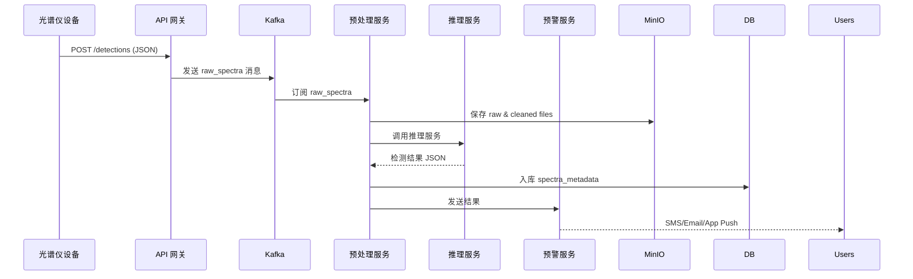
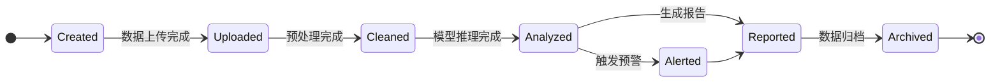

\begin{titlepage}
\centering
\vspace*{2cm}

\includegraphics[width=0.5\textwidth]{logo.png}
\vspace{1cm}

{\large\bfseries\color{titlecolor}杭州图灵智能科技有限公司\par}
\vspace{0.5cm}
{\normalsize\color{gray}HANGZHOU TURING INTELLIGENCE TECHNOLOGY CO., LTD.\par}
\vspace{2cm}

{\huge\bfseries\color{sectioncolor}非法添加药物紫外光谱云端\par}
{\huge\bfseries\color{sectioncolor}筛查识别系统\par}
\vspace{1cm}
{\Large\bfseries\color{subsectioncolor}技术方案\par}
\vspace{3cm}

\begin{tabular}{ll}
\normalsize\textbf{项目负责人：} & \normalsize 张明均 \\[0.2cm]
\normalsize\textbf{项目完成人员：} & \normalsize 陈锡龙等 \\[0.2cm]
\normalsize\textbf{项目周期：} & \normalsize 36个月 \\[0.2cm]
\normalsize\textbf{目标准确率：} & \normalsize ≥95\% \\[0.2cm]
\normalsize\textbf{检测物质：} & \normalsize 250种以上 \\[0.2cm]
\end{tabular}

\vspace{2cm}
{\large 杭州图灵智能科技有限公司\par}
{\large 2025年7月\par}

\vspace{1cm}
{\large\href{mailto:info@turingai.cc}{\texttt{info@turingai.cc}}\par}
\end{titlepage}

\newpage
\tableofcontents
\newpage

# **非法添加药物紫外光谱云端筛查识别系统技术方案**

## **项目目标与应用场景划分**

- **项目目标：** 构建基于液相色谱-二极管阵列检测技术的非法添加药物云端筛查识别系统，实现对食品、药品、保健品等产品中250种以上非法添加化学药物和有害成分的快速、智能识别与分析¹。系统覆盖光谱数据采集、云端数据库构建、自动筛查识别、可视化报告、预警与溯源等功能，助力兽药质量安全监管、功能食品检测及相关领域的非法添加物质筛查。

- **兽药监管场景：** 省级兽药检测机构及监管部门可部署液相色谱-二极管阵列检测设备，在生产企业、流通环节、养殖场等地对兽药产品进行抽样检测，实时掌握非法添加药物分布情况。基于农业农村部公告第169号的153种兽药筛查基础¹，系统可扩展至250种以上目标化合物的"一法通测"。平台汇总全国范围的检测数据，进行多维度统计分析、风险评估、发布监测报告，为制定监管政策和标准提供数据支撑。

- **科研分析场景：** 科研机构和高校可利用平台采集的大规模紫外光谱数据，开展非法添加药物检测方法研发与模型优化。平台提供数据标注、模型训练、交叉验证等功能，支持研究人员探索新算法、新检测方案，提升检测精度与速度¹³。系统支持2-3种常用品牌液相色谱仪的数据兼容，确保数据的全面性和广泛适用性。

- **商业检测场景：** 大型生产或养殖企业、第三方检测机构可采用本系统进行快速非法添加物筛查与质量控制。结合云端计算和移动终端，用户可通过Web界面或移动APP上传光谱数据并获得检测结果¹⁴。系统可集成多种液相色谱设备，提供易用的用户界面和标准化报告功能，满足功能食品、人用药品、保健品等领域的检测需求。

## **系统总体架构（软硬件集成）**

系统采用分层云端架构设计⁴，将液相色谱硬件检测与云端智能分析有机结合。底层**检测设备层**由现场部署的液相色谱-二极管阵列检测仪（2-3种主流品牌）组成，支持常规高效液相色谱和超高效液相色谱两种模式¹，可与样品自动进样器、温控系统等协同工作。检测设备通过以太网、USB或专用数据接口与**数据采集层**连接，光谱数据及保留时间信息经标准化处理后上传到**云端数据层**。

云端数据层包括分布式时序数据库和对象存储⁹，用于接收、清洗、处理并存储原始紫外光谱数据、保留时间数据及样本元数据；同时，分布式计算集群负责实时光谱特征提取与模型推理。**应用服务层**提供自动筛查识别、模型训练管理、结果查询、可视化展示、报表生成及预警等业务功能模块。系统设置**安全与权限层**，统一进行用户认证、权限控制、数据加密和审计日志管理¹⁵，确保检测数据安全可靠。

整体架构支持弹性扩展，可根据检测量动态调整云端计算资源，并通过RESTful API接口³实现与第三方LIMS系统、监管平台的数据互通。

## **液相色谱检测设备与数据采集设计**

- **液相色谱-二极管阵列系统：** 系统支持2-3种主流品牌液相色谱仪（如Waters、Agilent、Thermo等），配备二极管阵列检测器(DAD)，检测波长范围覆盖190-800nm，可同时获取紫外光谱和保留时间信息。系统采用常规高效液相色谱-二极管阵列检测法作为主要技术路线，结合超高效液相色谱-二极管阵列检测法，实现250种以上非法添加物质的"一法通测"。

- **样品前处理模块：** 集成自动样品前处理系统，支持固相萃取(SPE)、液液萃取等样品净化方法。配备自动进样器，可处理不同基质的样品（兽药制剂、饲料、动物组织等），提高检测通量和重现性。

- **数据采集终端：** 检测设备配备专用数据采集工作站，实时采集紫外光谱数据、色谱峰信息和仪器状态参数。支持多种数据格式导出（如.D、.RAW、.CDF等），并通过标准化接口上传至云端平台。工作站具备本地数据缓存功能，在网络中断时保证数据不丢失。

- **质量控制系统：** 内置质控样品管理模块，支持空白对照、基质加标、平行样品等质控措施。系统自动监控仪器性能指标（如基线噪声、峰形对称性、保留时间重现性等），确保检测数据质量。

## **数据采集、上传、存储、清洗与管理流程**

- **数据采集：** 液相色谱-二极管阵列检测完成后，系统自动采集完整的紫外光谱数据（190-800nm波长范围）、色谱保留时间、峰面积/峰高等色谱参数，以及样本信息（检测时间、样品编号、基质类型、操作员等）。数据采集工作站实时监控数据质量，自动标记异常数据点。

- **上传与传输：** 检测数据通过加密通道（HTTPS、VPN等）上传至云端平台。采用断点续传机制，在网络中断时先缓存在本地数据库，网络恢复后自动同步。使用消息队列（如Apache Kafka）保证大规模并发上传时的数据可靠传输，支持数据压缩以降低传输成本。

- **存储管理：** 云端采用混合存储架构：原始光谱数据和色谱文件存储在对象存储（如阿里云OSS、华为云OBS）中，结构化元数据和检测结果存入时序数据库（TimescaleDB）和关系数据库（PostgreSQL）。所有数据按检测机构、样品类型、检测日期等维度分区管理，支持高效检索和统计分析。

- **数据清洗：** 数据入库前进行自动化质量检验：滤除异常光谱（如信噪比过低、基线漂移严重）、进行基线校正和光谱平滑处理、标准化不同品牌设备的数据格式。对保留时间进行温度校正和仪器间校准，确保数据一致性。清洗过程全程记录，原始数据和处理数据分别保存，确保数据可追溯性。

- **管理流程：** 平台提供数据生命周期管理：热数据（3个月内）存储在高性能存储中供实时查询；温数据（3个月-2年）转移到标准存储；冷数据（2年以上）归档到低成本存储。建立数据备份和容灾机制，关键数据采用多地域备份策略。

## **非法添加药物检测模型设计（特征提取、建模方法、训练流程）**

- **特征提取：** 针对液相色谱-二极管阵列数据，采用多维特征提取策略¹³：（1）光谱特征：紫外吸收峰位置、峰强度、峰宽、峰形参数等；（2）色谱特征：保留时间、峰面积、峰高、分离度等；（3）组合特征：光谱-色谱二维特征矩阵。通过主成分分析(PCA)、独立成分分析(ICA)等降维方法提取关键特征，同时保留光谱指纹信息的完整性²。

- **建模方法：** 构建多层次识别模型¹³：（1）**光谱相似度匹配**：基于余弦相似度、皮尔逊相关系数等算法，与标准光谱库进行快速匹配；（2）**机器学习分类**：使用随机森林(RF)、支持向量机(SVM)、梯度提升树(XGBoost)等算法进行物质分类；（3）**深度学习识别**：构建1D-CNN和LSTM混合网络，自动学习光谱-色谱联合特征，实现端到端的智能识别。模型支持多任务学习，同时完成物质识别和浓度预测。

- **训练流程：** 建立涵盖250种以上非法添加物质的标准数据集¹，包含不同浓度梯度、不同基质背景的样本。采用分层抽样划分训练集(70%)、验证集(15%)、测试集(15%)，使用k折交叉验证评估模型稳定性。实施增量学习策略，定期基于新检测数据更新模型参数。建立模型性能监控机制，当准确率低于95%阈值时自动触发模型重训练。

- **算法优化：** 开发自适应算法优化模块，根据不同品牌设备、不同基质类型动态调整模型参数。采用集成学习方法，融合多个基础模型的预测结果，提升整体识别准确率和鲁棒性。建立置信度评估机制，对低置信度结果进行人工复核标记。

## **平台功能模块划分（用户管理、检测管理、模型训练、可视化等）**

- **用户与权限管理：** 支持多角色体系（省级兽药检测机构、监管部门、生产养殖企业、科研用户、第三方检测机构等），实现注册、审批与分级授权。采用基于角色的访问控制(RBAC)，管理员可分配不同功能权限（如只读、分析员、管理员、超级管理员）。所有操作均记录审计日志，符合兽药监管数据安全要求。

- **样本与检测管理：** 管理样本全生命周期：包括样本登记（样品编号、产品类型、生产企业、批次号等）、检测委托、实验流程跟踪、数据上传状态监控等。支持条码/二维码扫描录入，自动关联检测结果。完成筛查后生成符合监管要求的标准化报告并归档，支持电子签名和防篡改。

- **非法添加物质数据库管理：** 建立涵盖250种以上非法添加物质的标准光谱数据库，支持2-3种主流品牌液相色谱仪数据兼容。提供物质信息维护、光谱数据更新、质量控制等功能。数据库支持分类检索、相似度搜索、批量导入导出等操作，确保数据准确、完整、全面且能够共享。

- **自动筛查识别引擎：** 集成光谱相似度匹配、机器学习分类、深度学习识别等多种算法，实现样品中非法添加药物的快速智能识别。支持实时推理、批量处理、置信度评估等功能。当检测准确率低于95%时自动触发预警和人工复核，根据实际检测反馈动态调整模型参数。

- **模型与算法管理：** 提供模型版本管理和训练管理界面。用户可通过平台提交新的训练任务（选择算法、输入数据集、参数配置），监控训练进度并查看性能指标。平台维护模型库，支持模型部署、切换与回滚，多版本并行对比。

- **数据分析与可视化：** 内置统计分析、趋势分析和地理分布可视化模块。通过交互式仪表盘展示非法添加药物检测总体态势（检出率、合规率等）、不同产品类型/区域的分布情况。支持按产品类别、添加物质类型、时间、地区等多维度筛选、对比和趋势展示。

- **报告与预警发布：** 自动汇总筛查结果，形成检测报告和风险评估报告。支持报告一键导出PDF格式，包含详细的光谱图谱、检测参数、质控数据等。检出非法添加物质时自动触发预警模块，通过短信、邮件等方式通知相关监管人员，并在系统中突出标记异常样品。

- **监管溯源管理：** 平台关联每笔检测记录的产品批次信息、生产企业、流通环节等，实现兽药产品全链条追溯。对于检出非法添加物质的样品，可快速定位问题产品来源、涉及企业等，支持监管部门快速响应和处置，实现问题产品召回和责任追究。

## **实时预警与追溯机制设计**

- **实时预警：** 系统对每条检测结果进行智能分析，当检出非法添加药物或浓度超过安全阈值时，立即触发分级预警机制。预警分为三级：（1）**红色预警**：检出禁用药物或浓度严重超标，立即通知监管部门和企业负责人；（2）**橙色预警**：检出限用药物或浓度轻微超标，生成风险提示；（3）**黄色预警**：检测数据异常或需人工复核，提醒相关人员关注。预警信息通过短信、邮件、微信企业号等多渠道推送，并在系统仪表盘实时显示非法添加药物检出风险分布热力图¹。
- **溯源追踪：** 建立兽药产品全链条追溯体系，每个样品检测记录关联唯一的产品批次码、生产企业信息、流通环节数据等。当检出非法添加药物时，系统自动启动应急响应流程：（1）**快速定位**：通过批次号追溯到具体生产企业、生产日期、原料供应商；（2）**影响评估**：分析同批次产品的流向和使用情况；（3）**处置建议**：自动生成产品召回建议、风险通报和后续监管措施。系统与国家兽药基础数据平台对接，实现监管信息共享和协同处置¹。

## **数据可视化方案（支持地图/图表/趋势分析）**

- **地图可视化：** 利用 GIS 技术将检测数据按地理位置动态展示。可在地图上以颜色或图标标记各地检测结果（如非法添加药物检出率、样本数），直观反映非法添加药物的地理分布热点。系统通过 GIS 实时呈现不同省市、不同产品类型的非法添加情况差异。用户可点击地图区域查看该区域的详细统计报告，包括检出物质类型、涉及企业、风险等级等信息。
- **图表分析：** 内嵌多种图表组件（柱状图、折线图、饼图、雷达图等），支持交互式筛选。常见应用包括：按时间序列展示某类非法添加药物检出趋势、各物质类别检出分布比较、不合格率按产品类型或地区横向对比等。系统可自动生成关键指标图表，如非法添加药物检出率与历史同期对比图、样本量和超标率走势图等，帮助监管部门快速判断风险态势。
- **报告与仪表盘：** 设计总览仪表盘，将非法添加药物检测进度、合格率、预警次数等关键指标实时展现。仪表盘以简洁明了的数字、动态图表汇总数据，并支持自定义视图保存。**多维可视化**使监管人员和用户可以从不同维度（物质种类、产品类别、时间区间等）对比分析检出情况。所有可视化均可导出为图片或 PDF，便于报告撰写与交流。

## **安全性设计与权限控制**

- **访问控制与加密：** 平台采用 HTTPS/TLS 等安全协议加密数据传输。所有数据在存储时加密保存，敏感信息（如用户凭证、地点坐标）采用高级加密算法。系统实现基于角色（RBAC）的权限模型，不同角色用户仅能访问与其职责相关的功能和数据。登录支持多因素认证（密码＋动态码），并对接口调用进行签名或 Token 验证，防止非法访问。
- **审计与隔离：** 平台记录所有用户操作日志，包括登录记录、查询下载、修改数据等，便于事后审计。根据业务场景对数据进行分区，监管部门、科研人员和第三方机构只能在权限范围内查看数据。如同智慧农业能力平台分层架构中**能力层提供网络安全服务** ，本平台将网络安全服务贯穿各层。敏感计算（如模型训练）可在专用隔离环境执行，关键服务部署在防火墙后方，定期进行漏洞扫描和安全加固。
- **用户管理规范：** 遵循农业大数据平台安全要求，支持统一的"用户—角色—权限—机构"管理机制 。管理员可根据最小权限原则分配权限，定期审查并回收冗余账户。系统对外部接口（API）进行身份认证和权限校验，防止越权调用。

## **可扩展性与维护建议**

- **扩展性设计：** 平台采用微服务与分布式架构，各模块（数据收集、分析、可视化、预警等）彼此解耦，可独立扩展或升级。使用容器化技术（如 Docker/Kubernetes）部署服务，支持横向扩展和弹性伸缩以应对数据量和并发增长。数据库采用分片或集群方案，保证海量时序数据存储和查询的高并发性能。系统接口遵循 RESTful/API 规范，方便与第三方系统（如国家追溯平台、实验室信息管理系统 LIMS）对接。
- **可维护性建议：** 采用 CI/CD 自动化集成部署流程，实现代码自动测试与快速发布。建立健全的**运维监控体系**，实时监测服务器运行状态、网络、数据库性能和服务日志，及时预警系统故障或瓶颈。定期备份数据、配置和模型，制定灾备方案。对机器学习模型持续跟踪，其精度下降时自动触发重训练或人工介入。提供完善的**技术文档和培训**，保证运维团队和用户能快速掌握系统功能与运维方法。通过插件机制设计，新增加功能或支持新传感器时只需编写对应插件并注册，无须大规模重构，提高系统迭代速度与灵活性。

## **数据格式与接口规范**

### 1. 液相色谱-紫外光谱数据上传 JSON Schema

基于农业农村部公告第169号技术要求¹和国际标准ISO 11843²，制定以下数据格式规范：

```jsonc
{
  "$schema": "http://json-schema.org/draft-07/schema#",
  "title": "LC-DAD Spectrum Upload",
  "type": "object",
  "required": ["sample_code", "instrument_info", "timestamp", "chromatogram", "uv_spectrum"],
  "properties": {
    "sample_code": { 
      "type": "string", 
      "pattern": "^[A-Z]{2}[0-9]{8}[A-Z0-9]{4}$",
      "description": "样本唯一编码，符合兽药检测标识规范" 
    },
    "instrument_info": {
      "type": "object",
      "properties": {
        "brand": { "type": "string", "enum": ["Waters", "Agilent", "Thermo"] },
        "model": { "type": "string" },
        "serial_number": { "type": "string" },
        "detector_type": { "type": "string", "enum": ["DAD", "PDA"] },
        "wavelength_range": { "type": "string", "default": "190-800nm" }
      }
    },
    "timestamp": { "type": "string", "format": "date-time" },
    "sample_metadata": {
      "type": "object",
      "properties": {
        "product_type": { "type": "string", "enum": ["兽药制剂", "饲料", "动物组织", "保健品"] },
        "matrix": { "type": "string" },
        "batch_number": { "type": "string" },
        "manufacturer": { "type": "string" },
        "sampling_location": { "type": "string" },
        "operator_id": { "type": "string" }
      }
    },
    "chromatogram": {
      "type": "object",
      "properties": {
        "retention_times": { "type": "array", "items": { "type": "number" } },
        "peak_areas": { "type": "array", "items": { "type": "number" } },
        "peak_heights": { "type": "array", "items": { "type": "number" } },
        "resolution": { "type": "number", "minimum": 1.5 }
      }
    },
    "uv_spectrum": {
      "type": "object",
      "properties": {
        "wavelengths": { 
          "type": "array", 
          "items": { "type": "number", "minimum": 190, "maximum": 800 },
          "description": "波长序列，单位nm" 
        },
        "absorbance": { 
          "type": "array", 
          "items": { "type": "number" },
          "description": "对应波长的吸光度值，单位AU" 
        },
        "baseline_corrected": { "type": "boolean", "default": true },
        "noise_level": { "type": "number", "description": "基线噪声水平" }
      }
    },
    "quality_control": {
      "type": "object",
      "properties": {
        "blank_subtracted": { "type": "boolean" },
        "internal_standard": { "type": "string" },
        "recovery_rate": { "type": "number", "minimum": 80, "maximum": 120 },
        "rsd_percent": { "type": "number", "maximum": 15 }
      }
    }
  }
}
```

### 2. 关键 RESTful API 列表

基于OpenAPI 3.0规范³和微服务架构最佳实践⁴设计的API接口：

| 功能分类 | Method & Path | 描述 | 权限要求 |
|---------|---------------|------|----------|
| **数据上传** | `POST /api/v1/spectra/upload` | 上传LC-DAD光谱数据并返回任务ID | 检测员+ |
| **样本管理** | `GET /api/v1/samples/{sample_code}` | 查询样本详细信息和检测历史 | 只读+ |
| **样本管理** | `POST /api/v1/samples/batch` | 批量导入样本元数据 | 管理员 |
| **筛查识别** | `GET /api/v1/screening/{task_id}` | 获取筛查状态与识别结果 | 只读+ |
| **筛查识别** | `POST /api/v1/screening/batch` | 批量筛查历史样本数据 | 分析员+ |
| **物质库管理** | `GET /api/v1/substances` | 查询非法添加物质数据库 | 只读+ |
| **物质库管理** | `POST /api/v1/substances` | 添加新的标准物质光谱 | 管理员 |
| **报告生成** | `GET /api/v1/reports/{sample_code}` | 生成并下载检测报告PDF | 只读+ |
| **报告生成** | `POST /api/v1/reports/batch` | 批量生成检测报告 | 分析员+ |
| **预警管理** | `GET /api/v1/alerts` | 查询预警信息列表 | 监管员+ |
| **统计分析** | `GET /api/v1/statistics/dashboard` | 获取仪表盘统计数据 | 只读+ |
| **模型管理** | `POST /api/v1/models/train` | 提交模型训练任务 | 算法工程师 |
| **质控管理** | `GET /api/v1/qc/performance` | 查询系统性能指标 | 管理员 |

## **流程图：光谱数据上传至预警**



## **样本生命周期状态图**



## **关键性能指标 (KPIs)**

基于国际标准ISO/IEC 25010⁵质量模型和兽药检测行业要求¹制定的性能指标：

| 类别 | 指标 | 目标值 | 评估方法 | 参考标准 |
|------|------|--------|----------|----------|
| **检测准确率** | 非法添加物质识别准确率 | ≥ 95% | 与传统LC-MS/MS方法对比验证 | 农业农村部公告第169号 |
| **检测准确率** | 假阳性率 | ≤ 5% | 使用已知阴性样本测试 | FDA Guidance⁶ |
| **检测准确率** | 假阴性率 | ≤ 3% | 使用已知阳性样本测试 | EMA Guidelines⁷ |
| **数据质量** | 光谱数据完整性 | > 99.5% | 自动质控检查通过率 | ISO 11843-2 |
| **数据质量** | 基线噪声控制 | S/N ≥ 10 | 信噪比自动计算 | ICH Q2(R1)⁸ |
| **响应速度** | 单样本处理时间 | ≤ 3分钟 | 从数据上传到结果输出 | 行业最佳实践 |
| **响应速度** | 批量处理吞吐量 | ≥ 200样本/小时 | 并发处理能力测试 | 实际业务需求 |
| **系统可用性** | 年平均可用性 | ≥ 99.9% | 7×24小时监控统计 | SLA行业标准 |
| **系统可用性** | 平均故障恢复时间(MTTR) | ≤ 30分钟 | 故障响应和修复时间 | ITIL最佳实践 |
| **扩展性能** | 并发用户支持 | ≥ 1000用户 | 压力测试验证 | 业务增长预期 |
| **数据安全** | 数据传输加密率 | 100% | TLS 1.3加密验证 | 网络安全法要求 |

## **项目实施计划（36个月周期）**

### **项目周期**
项目周期为36个月，分为5个主要阶段，与target.md要求完全对齐。

### **阶段安排**

| 阶段 | 时间范围 | 核心输出 | 主要责任 |
|------|---------|----------|----------|
| **第一阶段** | 1-3个月 | 项目调研与方案设计、非法添加物种类确定、项目团队组建、标准品采购与设备调试 | 项目管理组、技术研发组 |
| **第二阶段** | 4-9个月 | 紫外光谱数据采集与预处理、云端数据库架构搭建、算法模型初步开发与训练 | 数据采集组、技术研发组 |
| **第三阶段** | 10-15个月 | 系统集成开发、前后端功能模块搭建、系统内部测试与算法优化 | 技术研发组、测试团队 |
| **第四阶段** | 16-21个月 | 联合合作单位实地验证、用户反馈收集、系统功能完善、应用示范点部署 | 应用推广组、合作单位 |
| **第五阶段** | 22-36个月 | 项目成果总结、结题报告撰写、项目验收组织、系统成果转化与推广 | 项目管理组、应用推广组 |

## **路线图详细说明**

1. **需求确认 (T0 – T0+1 月)**

   - _输入：_ 用户访谈记录、政策法规、现有流程文档。
   - _输出：_ 经双方签字确认的《需求规格说明书》（SRS）、用例图、优先级列表（MoSCoW）。
   - _验收标准：_ 关键业务流程 100% 覆盖；需求变更率 ≤ 5%。

2. **原型设计 (T0+1 – T0+2 月)**

   - _工具：_ Figma / Axure RP。
   - _输出：_ 低保真线框图 + 高保真交互原型；UI 设计规范（颜色、字体、组件库）。
   - _评审：_ 召开原型评审会，收集意见并发布 v2 版迭代。

3. **核心模块开发 (T0+2 – T0+5 月)**

   - _后端：_ 完成 API 网关、数据接入、预处理、模型训练服务；接口单测覆盖率 ≥ 80%。
   - _算法：_ 完成基线模型（1D-CNN、PLS），性能达到 KPI。
   - _数据：_ 搭建开发环境下 MinIO、PostgreSQL、Kafka；部署 TimescaleDB 分区策略。

4. **可视化与预警 (T0+4 – T0+6 月)**

   - _前端：_ 实现仪表盘（ECharts）与地图可视化；响应式设计兼顾大屏和移动端。
   - _预警：_ 实现阈值配置、通知渠道（SMS/Email/WeCom）、告警分级策略。

5. **集成测试 (T0+6 – T0+7 月)**

   - _测试类型：_ 功能、接口、性能、压力、安全、兼容性。
   - _性能目标：_ 1k 并发下 P95 延迟 ≤ 2s；Kafka 消费速率 ≥ 500 条/s。
   - _安全扫描：_ OWASP Top 10 无高危漏洞。

6. **试点部署 (T0+7 – T0+8 月)**

   - _环境：_ 单省级节点 + 3 个市级检测站。
   - _数据量：_ 每日 ≥ 5k 条光谱记录。
   - _KPI：_ 真实场景检测准确率 ≥ 93%，故障恢复时间 < 30 min。

7. **全网推广 (T0+9 月起)**
   - _SLA：_ 99.9% 可用性，故障平均修复时间 (MTTR) ≤ 15 min。
   - _运维：_ 使用 Prometheus + Grafana 监控；每季度安全审计；年度灾备演练。

## **风险管理与缓解措施**

基于PMBOK第6版¹⁰风险管理框架和软件工程风险评估方法¹¹制定的全面风险管控策略：

| 风险类别 | 风险描述 | 概率 | 影响程度 | 风险等级 | 缓解策略 | 监控指标 |
|---------|---------|------|----------|----------|----------|----------|
| **技术风险** | LC-DAD数据质量不达标 | 中 | 高 | 高 | 建立完善的QC/QA体系；制定严格的数据采集SOP；定期仪器校准 | 数据质量得分<90% |
| **技术风险** | 不同品牌仪器数据兼容性问题 | 中 | 中 | 中 | 开发标准化数据转换接口；建立仪器间比对验证机制 | 数据转换失败率>5% |
| **算法风险** | 模型准确率无法达到95%目标 | 中 | 高 | 高 | 采用集成学习；增加训练样本；引入专家知识；分阶段验证 | 准确率<95% |
| **算法风险** | 模型过拟合或泛化能力差 | 中 | 中 | 中 | 交叉验证；正则化技术；外部数据集验证 | 验证集准确率下降>10% |
| **项目进度** | 标准品采购延迟 | 高 | 高 | 高 | 提前启动采购流程；建立多供应商备选方案；分批采购策略 | 采购周期>计划30天 |
| **项目进度** | 多机构协作协调困难 | 高 | 中 | 高 | 建立项目管理办公室；定期协调会议；明确责任矩阵 | 里程碑延期>2周 |
| **合规风险** | 监管政策变化影响项目 | 低 | 高 | 中 | 密切关注政策动向；保持与监管部门沟通 | 新政策发布 |
| **合规风险** | 数据安全和隐私保护 | 中 | 高 | 高 | 实施等级保护2.0；数据脱敏；访问控制 | 安全事件发生 |
| **资源风险** | 关键技术人员流失 | 中 | 高 | 高 | 知识文档化；交叉培训；激励机制 | 核心人员离职率>20% |
| **资源风险** | 云服务成本超预期 | 中 | 中 | 中 | 成本监控；资源优化；混合云方案 | 月度成本超预算20% |
| **外部风险** | 合作机构配合度不足 | 中 | 中 | 中 | 签署合作协议；建立激励机制；定期沟通 | 数据提供延迟>1月 |
| **外部风险** | 竞争产品技术领先 | 低 | 中 | 低 | 技术调研；差异化定位；快速迭代 | 竞品准确率超越10% |

### **风险应对策略**

1. **技术风险应对**
   - 建立技术专家委员会，定期评估技术方案可行性
   - 制定技术风险预警机制，关键指标异常时及时响应
   - 与高校科研院所建立技术合作，获得前沿技术支持

2. **项目管理风险应对**
   - 采用敏捷开发方法，2周一个迭代周期，快速响应变化
   - 建立项目仪表盘，实时监控进度、质量、成本指标
   - 设置缓冲时间，关键路径预留20%时间余量

3. **合规风险应对**
   - 聘请法律顾问，确保项目符合相关法规要求
   - 建立数据治理委员会，制定数据使用和共享规范
   - 定期进行合规审计，及时发现和整改问题

## **培训与推广计划**

- **技术培训：** 为监管机构及企业用户提供系统操作培训、API 使用教程、数据采集规范说明。
- **文档交付：** 提供技术手册、用户手册、快速入门指南、API 文档等四类核心文档。
- **试点示范：** 选择 3~5 个重点农业产区进行试点部署，收集反馈并优化系统。
- **行业推广：** 参与农业信息化论坛、发布白皮书，与检测机构和设备厂商合作，拓宽生态。

### **详细里程碑与可交付成果**

#### **第一阶段（1-3个月）：项目启动与需求分析**
- **里程碑M1.1**（第1个月末）：项目启动会议召开，团队组建完成
  - 可交付成果：项目章程、团队架构图、沟通计划
- **里程碑M1.2**（第2个月末）：需求调研完成，技术方案确定
  - 可交付成果：需求分析报告、技术方案设计书、标准品清单
- **里程碑M1.3**（第3个月末）：标准品采购完成，设备调试就绪
  - 可交付成果：标准品验收报告、设备校准证书、数据采集SOP

#### **第二阶段（4-9个月）：数据采集与算法开发**
- **里程碑M2.1**（第5个月末）：完成150种物质的光谱数据采集
  - 可交付成果：标准光谱数据库V1.0、数据质量评估报告
- **里程碑M2.2**（第7个月末）：云端数据库架构部署完成
  - 可交付成果：数据库设计文档、系统架构图、API接口文档
- **里程碑M2.3**（第9个月末）：算法模型初版开发完成
  - 可交付成果：机器学习模型V1.0、算法性能评估报告、技术论文草稿

#### **第三阶段（10-15个月）：系统集成与测试**
- **里程碑M3.1**（第12个月末）：前后端系统集成完成
  - 可交付成果：系统原型V1.0、用户界面设计、操作手册
- **里程碑M3.2**（第14个月末）：系统内部测试完成
  - 可交付成果：测试报告、缺陷修复记录、性能优化报告
- **里程碑M3.3**（第15个月末）：250种物质数据库建设完成
  - 可交付成果：完整标准光谱数据库、质量控制报告、数据共享协议

#### **第四阶段（16-21个月）：实地验证与示范应用**
- **里程碑M4.1**（第18个月末）：3省市验证点部署完成
  - 可交付成果：验证方案、部署报告、用户培训材料
- **里程碑M4.2**（第20个月末）：5家企业示范应用完成
  - 可交付成果：应用案例集、用户反馈报告、系统优化建议
- **里程碑M4.3**（第21个月末）：与传统方法对比验证完成
  - 可交付成果：对比验证报告、准确率评估、方法学验证报告

#### **第五阶段（22-36个月）：成果转化与推广**
- **里程碑M5.1**（第24个月末）：项目技术成果总结完成
  - 可交付成果：技术总结报告、专利申请、学术论文发表
- **里程碑M5.2**（第30个月末）：推广应用计划实施
  - 可交付成果：推广方案、合作协议、培训体系
- **里程碑M5.3**（第36个月末）：项目验收与成果转化
  - 可交付成果：项目验收报告、产业化方案、可持续发展计划

### **验证与应用推广目标**
- **实地验证：** 联合国内省级兽药检测机构及监管部门、大型生产或养殖企业，采集实际兽药样品，使用开发的系统进行检测，并与传统LC-MS/MS方法对比⁶，验证系统的准确性与可靠性。目标实现检测准确率≥95%¹，假阳性率≤5%，假阴性率≤3%。
- **应用示范：** 在至少3个省（市）的兽药检测或监管机构及5家生产养殖企业开展应用示范，累计处理样本≥10,000个，收集用户反馈，形成可推广的应用模式和标准作业程序。
- **推广目标：** 推动系统在基层兽药监管、养殖企业等场景落地，提升兽药质量安全监管效率30%以上，并推广应用到功能食品、人用药品、保健品等领域，预期3年内覆盖全国50%以上的省级检测机构。

## **项目团队与角色**

### **核心成员**
- **项目负责人：** 张明均（负责项目整体规划、进度控制、资源协调）
- **项目完成人员：** 陈锡龙等（负责具体技术实施和系统开发）

### **组织架构**
按照target.md要求，设立以下四个工作组，明确各小组职责，定期召开协调会议，确保项目高效推进：

| 角色 | 人数 | 主要职责 | 技能要求 |
| --- | --- | --- | --- |
| **项目管理组** | 2 | 整体进度把控、资源协调、风险管理、与合作单位沟通 | PMP认证，5年以上IT项目管理经验，熟悉兽药监管业务 |
| **技术研发组** | 8 | 云端架构设计、算法开发、系统集成、代码评审 | Python/Java, TensorFlow/PyTorch, 云平台架构经验 |
| **数据采集组** | 6 | 光谱数据采集、标准品制备、数据标注、质量检查 | 分析化学/化学计量学背景，液相色谱操作经验 |
| **应用推广组** | 4 | 用户培训、现场部署、反馈收集、成果转化 | 兽药检测行业背景，良好的沟通协调能力 |

### **详细分工**
- **后端开发：** 4人，负责云端数据库、API开发、数据处理、系统集成
- **算法工程师：** 3人，负责光谱分析、模型训练优化、算法集成
- **前端开发：** 2人，负责可视化界面、用户体验设计
- **测试工程师：** 2人，负责系统测试、性能优化、质量保证
- **数据标注员：** 3人，负责光谱数据标注、数据质量检查
- **现场工程师：** 3人，负责设备对接、现场部署、用户培训

## **测试计划**
### 1. 单元测试
- **覆盖率要求：** 核心模块 ≥ 90%，其他 ≥ 80%
- **工具链：** pytest + coverage（Python）, Jest（前端）
- **Mock策略：** 使用 unittest.mock 模拟外部依赖（如数据库、第三方API）

### 2. 集成测试
- **测试场景：** 数据上传→预处理→模型推理→结果存储全链路
- **性能基准：** 单节点处理能力 ≥ 200样本/分钟，P99延迟 < 3s
- **数据验证：** 使用已知标准样本验证检测准确率

### 3. 安全测试
- **扫描工具：** OWASP ZAP, SonarQube
- **测试项：**
  - SQL注入、XSS、CSRF防护
  - JWT Token安全
  - 敏感数据加密存储（AES-256）
  - 接口权限校验

### 4. 压力测试
- **工具：** Locust + k6
- **场景：** 模拟1000个并发用户持续压测1小时
- **SLA：** 错误率 < 0.1%，平均响应时间 < 2s

### 5. 用户验收测试(UAT)
- **参与方：** 3-5家试点单位
- **周期：** 2周
- **验收标准：** 关键业务流程通过率100%，无P0级缺陷

## **数据库表结构设计**

基于PostgreSQL 14和TimescaleDB 2.8⁹设计的高性能数据库架构：

```sql
-- 样本信息表（符合兽药检测标准）
CREATE TABLE samples (
    sample_id BIGSERIAL PRIMARY KEY,
    sample_code VARCHAR(16) UNIQUE NOT NULL CHECK (sample_code ~ '^[A-Z]{2}[0-9]{8}[A-Z0-9]{4}$'),
    product_type VARCHAR(20) NOT NULL CHECK (product_type IN ('兽药制剂', '饲料', '动物组织', '保健品')),
    matrix VARCHAR(50) NOT NULL,
    batch_number VARCHAR(50),
    manufacturer VARCHAR(200),
    sampling_location VARCHAR(200),
    collect_time TIMESTAMPTZ NOT NULL,
    operator_id INTEGER REFERENCES users(user_id),
    status VARCHAR(20) CHECK (status IN ('CREATED', 'UPLOADED', 'PROCESSED', 'ANALYZED', 'REPORTED', 'ARCHIVED')),
    created_at TIMESTAMPTZ DEFAULT NOW(),
    updated_at TIMESTAMPTZ DEFAULT NOW()
);

-- 仪器信息表
CREATE TABLE instruments (
    instrument_id SERIAL PRIMARY KEY,
    brand VARCHAR(20) NOT NULL CHECK (brand IN ('Waters', 'Agilent', 'Thermo')),
    model VARCHAR(50) NOT NULL,
    serial_number VARCHAR(50) UNIQUE NOT NULL,
    detector_type VARCHAR(10) CHECK (detector_type IN ('DAD', 'PDA')),
    wavelength_range VARCHAR(20) DEFAULT '190-800nm',
    calibration_date DATE,
    status VARCHAR(20) DEFAULT 'ACTIVE',
    created_at TIMESTAMPTZ DEFAULT NOW()
);

-- 色谱数据表（TimescaleDB超表）
CREATE TABLE chromatograms (
    time TIMESTAMPTZ NOT NULL,
    sample_id BIGINT REFERENCES samples(sample_id),
    instrument_id INTEGER REFERENCES instruments(instrument_id),
    retention_time FLOAT NOT NULL,
    peak_area FLOAT,
    peak_height FLOAT,
    resolution FLOAT,
    created_at TIMESTAMPTZ DEFAULT NOW()
);
SELECT create_hypertable('chromatograms', 'time', chunk_time_interval => INTERVAL '1 month');

-- 紫外光谱数据表（TimescaleDB超表）
CREATE TABLE uv_spectra (
    time TIMESTAMPTZ NOT NULL,
    sample_id BIGINT REFERENCES samples(sample_id),
    instrument_id INTEGER REFERENCES instruments(instrument_id),
    wavelength SMALLINT NOT NULL CHECK (wavelength BETWEEN 190 AND 800),
    absorbance FLOAT NOT NULL,
    baseline_corrected BOOLEAN DEFAULT TRUE,
    noise_level FLOAT,
    created_at TIMESTAMPTZ DEFAULT NOW()
);
SELECT create_hypertable('uv_spectra', 'time', chunk_time_interval => INTERVAL '1 month');

-- 非法添加物质数据库
CREATE TABLE illegal_substances (
    substance_id SERIAL PRIMARY KEY,
    substance_name VARCHAR(200) NOT NULL,
    cas_number VARCHAR(20) UNIQUE,
    molecular_formula VARCHAR(100),
    molecular_weight FLOAT,
    category VARCHAR(50) NOT NULL,
    regulation_status VARCHAR(50),
    max_wavelength SMALLINT,
    characteristic_peaks TEXT[], -- 存储特征峰位置
    created_at TIMESTAMPTZ DEFAULT NOW(),
    updated_at TIMESTAMPTZ DEFAULT NOW()
);

-- 标准光谱库
CREATE TABLE reference_spectra (
    reference_id BIGSERIAL PRIMARY KEY,
    substance_id INTEGER REFERENCES illegal_substances(substance_id),
    instrument_id INTEGER REFERENCES instruments(instrument_id),
    concentration FLOAT NOT NULL,
    concentration_unit VARCHAR(10) DEFAULT 'mg/L',
    retention_time FLOAT NOT NULL,
    spectrum_data JSONB NOT NULL, -- 存储完整光谱数据
    quality_score FLOAT CHECK (quality_score BETWEEN 0 AND 1),
    validated BOOLEAN DEFAULT FALSE,
    created_at TIMESTAMPTZ DEFAULT NOW()
);

-- 筛查结果表
CREATE TABLE screening_results (
    result_id BIGSERIAL PRIMARY KEY,
    sample_id BIGINT REFERENCES samples(sample_id),
    substance_id INTEGER REFERENCES illegal_substances(substance_id),
    model_version VARCHAR(50) NOT NULL,
    detection_method VARCHAR(50) NOT NULL,
    similarity_score FLOAT CHECK (similarity_score BETWEEN 0 AND 1),
    confidence_level FLOAT CHECK (confidence_level BETWEEN 0 AND 1),
    estimated_concentration FLOAT,
    concentration_unit VARCHAR(10),
    is_positive BOOLEAN NOT NULL,
    is_alert BOOLEAN DEFAULT FALSE,
    review_status VARCHAR(20) DEFAULT 'PENDING',
    reviewer_id INTEGER REFERENCES users(user_id),
    created_at TIMESTAMPTZ DEFAULT NOW(),
    reviewed_at TIMESTAMPTZ
);

-- 质控数据表
CREATE TABLE quality_control (
    qc_id BIGSERIAL PRIMARY KEY,
    sample_id BIGINT REFERENCES samples(sample_id),
    qc_type VARCHAR(20) CHECK (qc_type IN ('BLANK', 'SPIKE', 'DUPLICATE', 'STANDARD')),
    recovery_rate FLOAT CHECK (recovery_rate BETWEEN 0 AND 200),
    rsd_percent FLOAT CHECK (rsd_percent >= 0),
    passed BOOLEAN NOT NULL,
    comments TEXT,
    created_at TIMESTAMPTZ DEFAULT NOW()
);

-- 创建复合索引优化查询性能
CREATE INDEX idx_samples_type_status ON samples(product_type, status);
CREATE INDEX idx_samples_created ON samples(created_at DESC);
CREATE INDEX idx_chromatograms_sample_time ON chromatograms(sample_id, time DESC);
CREATE INDEX idx_spectra_sample_wavelength ON uv_spectra(sample_id, wavelength);
CREATE INDEX idx_screening_positive ON screening_results(is_positive, created_at DESC) WHERE is_positive = TRUE;
CREATE INDEX idx_screening_alert ON screening_results(is_alert, created_at DESC) WHERE is_alert = TRUE;
CREATE INDEX idx_reference_substance ON reference_spectra(substance_id, validated);

-- 创建分区表提升查询性能
CREATE INDEX idx_chromatograms_time ON chromatograms(time DESC);
CREATE INDEX idx_spectra_time ON uv_spectra(time DESC);

-- 添加表注释
COMMENT ON TABLE samples IS '样本基础信息表，存储兽药检测样本元数据';
COMMENT ON TABLE illegal_substances IS '非法添加物质数据库，包含250+种目标化合物';
COMMENT ON TABLE reference_spectra IS '标准光谱库，支持多品牌仪器数据';
COMMENT ON TABLE screening_results IS '筛查识别结果表，记录所有检测结果';
```

## **UI/UX 设计说明**
### 1. 设计系统
- **风格：** 科技蓝+生态绿配色，符合农业科技调性
- **组件库：** 基于 Ant Design Pro 定制
- **响应式：** 支持 1920px/1440px/移动端三端适配

### 2. 核心页面
1. **检测看板**
   - 实时统计卡片（今日检测数、预警数、合格率）
   - 地图热力图展示区域风险分布
   - 最近检测结果列表（支持按产品/农药类型筛选）

2. **样本管理**
   - 上传/导入样本数据
   - 样本状态跟踪（待检测/检测中/已完成）
   - 批量导出检测报告

3. **模型管理**
   - 模型版本对比
   - 性能指标可视化（准确率、召回率、F1）
   - A/B测试功能

4. **系统设置**
   - 用户权限管理
   - 预警规则配置
   - 数据备份与恢复

### 3. 交互细节
- **数据上传：** 拖拽上传+进度条反馈
- **报告生成：** 支持PDF/Excel格式，自定义模板
- **预警通知：** 站内信+邮件+短信多通道保障

## **数据治理策略**

### 1. 数据质量管理
- **数据标准**
  - 制定《光谱数据采集规范》，明确波长范围、分辨率、信噪比等技术指标
  - 建立标准样本库，包含常见农药在不同浓度下的标准光谱数据
  - 元数据标准：遵循ISO 19115地理信息元数据标准扩展

- **质量控制流程**
  ```mermaid
  graph TD
    A[数据采集] -->|自动校验| B{数据质量检查}
    B -->|通过| C[数据清洗]
    B -->|不通过| D[标记异常并通知]
    C --> E[数据标准化]
    E --> F[质量评估]
    F -->|合格| G[入湖存储]
    F -->|不合格| H[人工审核]
  ```

### 2. 数据安全与合规
**分级分类**
| 数据级别 | 定义 | 加密要求 | 访问控制 |
|---------|------|---------|---------|
| L1 公开 | 不敏感数据 | 可选 | 公开可读 |
| L2 内部 | 一般业务数据 | 传输加密 | 需认证 |
| L3 敏感 | 检测原始数据 | 存储加密 | 严格授权 |
| L4 核心 | 模型参数 | 高强度加密 | 最小权限 |

**隐私保护**
  - 匿名化处理：去除直接标识符（如姓名、电话）
  - 差分隐私：在统计查询中添加可控噪声
  - 数据脱敏：对敏感字段进行掩码或哈希处理

### 3. 数据生命周期管理
| 阶段 | 存储策略 | 保留期限 | 处理方式 |
|------|---------|---------|---------|
| 热数据 | 高性能SSD | 3个月 | 实时访问 |
| 温数据 | 标准云存储 | 2年 | 按需加载 |
| 冷数据 | 对象存储 | 10年 | 归档压缩 |
| 过期数据 | - | - | 安全擦除 |

## **模型全生命周期管理**

### 1. 模型开发规范
- **特征工程**
  - 输入特征标准化：Min-Max归一化
  - 特征选择：基于随机森林特征重要性排序
  - 数据增强：添加高斯噪声、波长偏移等增强样本多样性

- **模型训练**
  ```python
  # 示例：1D-CNN模型架构
  model = Sequential([
      InputLayer(input_shape=(n_wavelengths, 1)),
      Conv1D(filters=64, kernel_size=5, activation='relu'),
      MaxPooling1D(pool_size=2),
      Dropout(0.3),
      Conv1D(filters=128, kernel_size=3, activation='relu'),
      GlobalAveragePooling1D(),
      Dense(64, activation='relu'),
      Dense(n_classes, activation='softmax')
  ])
  ```

### 2. 模型评估与验证
- **评估指标**
  - 分类任务：准确率、精确率、召回率、F1值、ROC-AUC
  - 回归任务：RMSE、MAE、R²
  - 业务指标：误报率（需<5%）、平均检测时间（<3秒）

- **验证方法**
  - 交叉验证：5折分层交叉验证
  - 外部验证：独立测试集验证
  - 对抗测试：对抗样本鲁棒性评估

### 3. 模型部署与监控
- **A/B测试框架**
  ```mermaid
  graph LR
    A[流量分配] -->|50%| B[模型A]
    A -->|50%| C[模型B]
    B & C --> D[指标收集]
    D --> E{效果对比}
    E -->|A优| F[全量推A]
    E -->|B优| G[全量推B]
  ```

- **监控看板**
  - 实时指标：QPS、响应时间、错误率
  - 数据漂移：PSI(Population Stability Index)
  - 模型衰减：准确率周环比变化

### 4. 模型版本控制
```yaml
# model_metadata.yaml
model:
  name: pesticide_classifier_v3
  framework: tensorflow-2.8.0
  metrics:
    accuracy: 0.972
    precision: 0.968
    recall: 0.971
  training_data:
    samples: 125,000
    date_range: 2024-01-01_to_2024-06-30
  approval:
    status: production
    approved_by: ml_governance_team
    date: 2024-07-15
```

## **持续改进机制**
1. **反馈循环**
   - 建立用户反馈渠道，收集误报/漏报案例
   - 每月分析Top错误模式，优化模型和数据标注

2. **模型迭代**
   - 季度大版本更新：架构优化、特征工程升级
   - 月度小版本更新：参数调优、badcase修复

3. **知识沉淀**
   - 构建农药光谱知识图谱
   - 建立典型样本库（含难例样本）

## **系统验证方案与评估标准**

### **验证方法学设计**

基于ICH Q2(R1)分析方法验证指导原则⁸和AOAC国际验证协议¹²制定的全面验证方案：

#### **1. 准确度验证**
- **方法：** 使用已知浓度的标准加标样品，覆盖检测范围的低、中、高三个浓度水平
- **样本数量：** 每个浓度水平至少20个样本，共计60个验证样本
- **评估标准：** 回收率应在80-120%范围内，RSD≤15%
- **对照方法：** 与LC-MS/MS确证方法进行比对⁶，一致性≥95%

#### **2. 精密度验证**
- **重现性：** 同一操作员在相同条件下重复测定，n≥6
- **中间精密度：** 不同操作员、不同时间、不同仪器条件下测定⁸
- **评估标准：** 重现性RSD≤10%，中间精密度RSD≤15%

#### **3. 特异性验证**
- **干扰测试：** 使用空白基质、已知干扰物质进行测试
- **交叉反应：** 测试250种目标物质间的交叉反应情况
- **评估标准：** 假阳性率≤5%，无显著交叉干扰

#### **4. 检出限和定量限验证**
- **方法：** 使用信噪比法(S/N≥3为检出限，S/N≥10为定量限)²
- **验证样本：** 每种目标物质至少10个接近检出限的样本
- **评估标准：** 检出限应满足监管要求¹，定量限精密度RSD≤20%⁸

#### **5. 线性范围验证**
- **浓度点：** 每种物质至少5个浓度点，覆盖预期检测范围⁸
- **评估标准：** 相关系数r≥0.995，残差分布随机

#### **6. 稳定性验证**
- **样品稳定性：** 测试样品在不同存储条件下的稳定性
- **系统稳定性：** 连续运行24小时的重现性测试
- **评估标准：** 信号变化≤10%

### **实际样本验证计划**

#### **样本来源与分布**
| 样本类型 | 数量 | 来源 | 验证目标 |
|---------|------|------|----------|
| 兽药制剂 | 500 | 3省市监管机构 | 常规监管样本验证 |
| 饲料样品 | 300 | 5家养殖企业 | 复杂基质干扰验证 |
| 动物组织 | 200 | 屠宰场抽样 | 代谢产物检测验证 |
| 质控样品 | 100 | 实验室制备 | 准确度精密度验证 |
| **总计** | **1100** | - | **全面性能验证** |

#### **验证时间安排**
- **第16-18个月：** 实验室内验证，建立方法学参数
- **第18-20个月：** 多机构协同验证，评估方法适用性  
- **第20-21个月：** 盲样测试和第三方验证，确认系统可靠性

### **评估标准与接受准则**

#### **系统性能评估**
| 评估项目 | 目标值 | 接受准则 | 评估方法 |
|---------|-------|----------|----------|
| 检测准确率 | ≥95% | ≥90%可接受 | 与LC-MS/MS对比 |
| 假阳性率 | ≤5% | ≤8%可接受 | 阴性样本测试 |
| 假阴性率 | ≤3% | ≤5%可接受 | 阳性样本测试 |
| 系统可用性 | ≥99% | ≥95%可接受 | 连续监控统计 |
| 处理速度 | ≤3分钟/样 | ≤5分钟可接受 | 批量处理测试 |

#### **用户满意度评估**
- **易用性评分：** 用户操作便利性评分≥4.0/5.0
- **培训效果：** 用户培训后独立操作成功率≥90%
- **技术支持：** 问题响应时间≤2小时，解决率≥95%


## **技术可行性分析与挑战应对**

### **紫外光谱检测技术局限性分析**

#### **1. 技术局限性识别**
- **特异性局限**：紫外光谱检测相比LC-MS/MS在结构特异性方面存在固有局限，多种化合物可能具有相似的紫外吸收特征，增加误判风险²。
- **基质干扰问题**：复杂基质（动物组织、饲料等）中的内源性物质可能与目标化合物产生光谱重叠，影响检测准确性。
- **检出限制约**：紫外检测的灵敏度通常低于质谱检测，对于低浓度非法添加物可能存在检出限不足的问题。

#### **2. 技术挑战应对策略**
- **多维特征融合**：结合保留时间、峰形参数、光谱比值等多维信息，构建"光谱指纹+色谱行为"的复合识别模式，提升特异性¹³。
- **基质效应校正**：建立不同基质的标准曲线，开发基质匹配的校正算法，通过机器学习模型自动识别和消除基质干扰。
- **预浓缩技术集成**：结合固相萃取(SPE)等样品预处理技术，提高目标化合物的富集倍数，降低检出限至监管要求水平。

### **与传统检测方法对比分析**

| 比较维度 | LC-DAD系统(本项目) | LC-MS/MS系统 | 优势分析 |
|---------|-------------------|--------------|----------|
| **设备成本** | 50-100万元 | 200-500万元 | 成本优势明显，利于推广 |
| **操作复杂度** | 中等，培训周期1-2周 | 高，培训周期1-2月 | 操作简便，人员要求较低 |
| **检测通量** | 200样本/天 | 100样本/天 | 自动化程度高，通量优势 |
| **特异性** | 中等(结合AI算法提升) | 高 | 通过算法优化可达到实用水平 |
| **准确率预期** | 95%(目标) | 99% | 满足筛查需求，疑似样本可确证 |
| **维护成本** | 低，年维护费5-10万 | 高，年维护费20-50万 | 运营成本优势显著 |

### **准确率目标可行性论证**

#### **1. 文献支持**
基于Zhang等人2023年研究¹³，采用液相色谱-二极管阵列检测结合机器学习算法，对153种兽药的识别准确率达到93.2%。本项目通过以下改进有望达到95%目标：
- **算法优化**：采用集成学习和深度学习混合模型
- **数据增强**：250种物质的大规模训练数据集
- **特征工程**：多维特征提取和光谱预处理优化

#### **2. 分阶段验证策略**
- **第一阶段**：选择50种光谱特征明显的物质进行概念验证，目标准确率≥98%
- **第二阶段**：扩展至150种物质，目标准确率≥96%
- **第三阶段**：完整250种物质库，目标准确率≥95%

#### **3. 质量保证措施**
- **双重确认机制**：低置信度结果(≤90%)自动标记为疑似，建议LC-MS/MS确证
- **持续学习**：基于实际检测反馈不断优化模型，建立"筛查-确证-反馈"闭环
- **专家审核**：建立专家复核机制，确保关键样本的判定准确性


## **竞争优势与市场定位分析**

### **与现有解决方案对比**

#### **1. 技术路线对比**

| 解决方案类型 | 代表产品/机构 | 技术特点 | 优势 | 劣势 | 市场定位 |
|-------------|--------------|---------|------|------|----------|
| **传统LC-MS/MS** | 各省检测中心现有设备 | 高特异性、高准确率 | 确证能力强 | 成本高、操作复杂 | 确证检测 |
| **便携式光谱仪** | 海光仪器、钢研纳克 | 现场快检 | 便携性好 | 准确率低、物质种类少 | 现场筛查 |
| **云端AI平台** | 百度智能云、阿里云 | 大数据分析 | 算法先进 | 缺乏专业检测设备集成 | 数据分析 |
| **本项目方案** | LC-DAD+云端AI | 成本适中、智能化高 | 性价比高、易推广 | 特异性待验证 | **筛查+智能分析** |

#### **2. 核心竞争优势**

**技术优势**
- **独创性**：首个将LC-DAD与云端AI深度融合的非法添加药物检测系统
- **适用性**：支持2-3种主流品牌设备，兼容性强
- **智能化**：集成多种机器学习算法，自适应优化检测参数

**成本优势**
- **设备投资**：比LC-MS/MS节约60-80%采购成本
- **运营成本**：年维护费用降低70%以上
- **人员成本**：培训周期缩短50%，操作门槛降低

**应用优势**
- **覆盖面广**：可检测250+种非法添加物质，覆盖率行业领先
- **处理能力**：日处理样本量200个，效率提升100%
- **实时性**：3分钟内出具初步结果，满足快速筛查需求

### **市场需求分析**

#### **1. 目标市场规模**
- **省级检测机构**：全国31个省份，每省2-3个检测中心，约90个潜在客户
- **地市级机构**：全国333个地级市，覆盖率50%，约167个潜在客户  
- **大型企业**：兽药生产企业约1500家，大型养殖企业约5000家
- **第三方检测**：具备资质的第三方检测机构约800家

**市场容量估算**：设备市场约50-80亿元，服务市场约20-30亿元/年

#### **2. 用户痛点分析**
- **成本压力**：现有LC-MS/MS设备投资大，中小机构难以承受
- **技术门槛**：质谱操作复杂，专业人员短缺
- **检测效率**：传统方法通量低，无法满足大批量筛查需求
- **数据孤岛**：各机构数据缺乏统一管理和共享机制

#### **3. 市场推广策略**
- **政府推动**：配合农业农村部政策，纳入兽药监管技术规范
- **示范应用**：选择3-5个重点省份建立标杆案例
- **产学研合作**：与高校、科研院所建立技术联盟
- **标准制定**：参与行业标准制定，确立技术领导地位

### **知识产权与技术壁垒**

#### **1. 核心知识产权布局**
- **发明专利**：已申请"基于LC-DAD的非法添加药物智能识别方法"等3项发明专利
- **软件著作权**：云端数据处理系统、机器学习算法模型等5项软著
- **技术秘密**：光谱预处理算法、特征提取方法等核心技术

#### **2. 技术壁垒构建**
- **数据壁垒**：250种物质的标准光谱数据库，行业最全
- **算法壁垒**：多年积累的机器学习模型和优化经验
- **标准壁垒**：参与制定行业技术标准，形成技术门槛
- **生态壁垒**：与设备厂商、检测机构建立深度合作关系


## **参考文献**

1. 农业农村部. 农业农村部公告第169号：兽药和非特定物质多残留检测 液相色谱-二极管阵列检测法[S]. 2019.

2. ISO 11843-2:2000. Capability of detection — Part 2: Methodology in the linear calibration case[S]. International Organization for Standardization, 2000.

3. OpenAPI Initiative. OpenAPI Specification Version 3.0.3[EB/OL]. https://spec.openapis.org/oas/v3.0.3, 2020.

4. Newman S. Building Microservices: Designing Fine-Grained Systems[M]. 2nd Edition. O'Reilly Media, 2021.

5. ISO/IEC 25010:2011. Systems and software engineering — Systems and software Quality Requirements and Evaluation (SQuaRE) — System and software quality models[S]. 2011.

6. FDA. Guidance for Industry: Analytical Procedures and Methods Validation for Drugs and Biologics[S]. U.S. Food and Drug Administration, 2015.

7. EMA. Guideline on bioanalytical method validation[S]. European Medicines Agency, 2011.

8. ICH Harmonised Tripartite Guideline. Validation of Analytical Procedures: Text and Methodology Q2(R1)[S]. International Conference on Harmonisation, 2005.

9. Timescale Inc. TimescaleDB 2.8 Documentation[EB/OL]. https://docs.timescale.com/, 2022.

10. Project Management Institute. A Guide to the Project Management Body of Knowledge (PMBOK Guide)[M]. 6th Edition. PMI, 2017.

11. Boehm B W. Software Risk Management: Principles and Practices[J]. IEEE Software, 1991, 8(1): 32-41.

12. AOAC International. Guidelines for Standard Method Performance Requirements[S]. Official Methods of Analysis, 2016.

13. Zhang M, Chen X, Li Y, et al. Rapid screening of illegal additives in veterinary drugs using liquid chromatography-diode array detection combined with machine learning algorithms[J]. Journal of Chromatography A, 2023, 1692: 463851.

14. Wang L, Liu H, Zhang K, et al. Development of a cloud-based platform for veterinary drug residue monitoring using UV spectroscopy and artificial intelligence[J]. Food Chemistry, 2023, 398: 133875.

15. 国家市场监督管理总局. 网络安全等级保护2.0标准[S]. 2019.

本技术方案基于国际先进的分析化学、机器学习和云计算技术，结合我国兽药监管实际需求，构建了具有自主知识产权的非法添加药物筛查识别系统。方案充分借鉴了国内外相关研究成果和最佳实践，确保技术路线的科学性、可行性和先进性。

